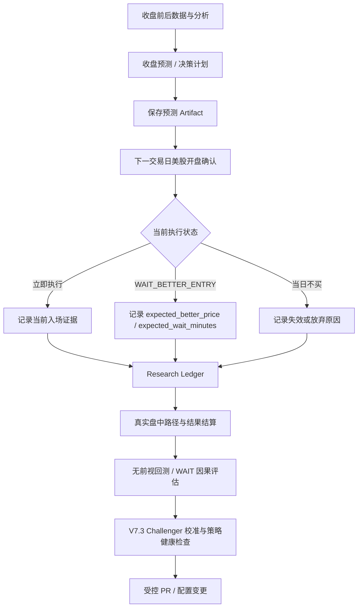

<div align="center">

# 📈 股票智能分析与交易研究系统

[](https://github.com/gikh202/daily_stock_analysis/stargazers)
[](LICENSE)
[](https://www.python.org/downloads/)
[](https://github.com/gikh202/daily_stock_analysis/actions)
[](docs/full-guide.md#docker-部署)

> 基于多源行情、新闻、基本面与大模型的多市场股票分析系统，并在本仓库中扩展了美股“收盘预测 → 开盘确认 → 真实结果回测 → 策略校准”的研究闭环。

[**核心能力**](#-核心能力) · [**美股决策闭环**](#-美股决策闭环) · [**系统架构**](#-系统架构) · [**自动化工作流**](#-自动化工作流) · [**快速开始**](#-快速开始) · [**文档**](#-文档)

</div>

## 项目定位

本项目同时覆盖两类使用场景：

1. **通用股票分析平台**：对 A 股、港股、美股、日股、韩股、台股及 ETF 聚合行情、K 线、技术指标、新闻、公告与基本面数据，通过 AI 生成结构化分析报告，并支持 Web、API、Bot、桌面端和多种通知渠道。
2. **美股决策研究系统**：在常规收盘分析基础上，将上一收盘形成的计划带到下一个交易日开盘，用真实盘中行情重新确认，并把后续结果沉淀为 research ledger，用于验证 WAIT_BETTER_ENTRY、入场时机和策略健康度。

本仓库的目标不是让模型直接“猜涨跌”或自动下单，而是把 **预测、执行前确认、真实结果记录、无前视回测和策略校准** 串成可审计的工程闭环。

---

## ✨ 核心能力

| 能力 | 当前实现 |
|---|---|
| AI 决策报告 | 核心结论、趋势、评分、风险、催化因素、买卖/等待条件与操作检查清单 |
| 多市场数据聚合 | A 股、港股、美股、日股、韩股、台股、ETF；支持多数据源 fallback |
| 多模型支持 | LiteLLM 路由、Gemini、OpenAI 兼容、DeepSeek、Claude、Ollama 等；同时保留可选本地 CLI generation backend |
| Web / API / Bot | FastAPI 后端、React Web 工作台、策略问股、历史报告、回测、持仓与配置管理 |
| 自动化分析 | GitHub Actions、Docker、本地 CLI 与定时任务 |
| 多渠道通知 | 企业微信、飞书、Telegram、Discord、Slack、邮件及其他 webhook 类渠道 |
| 美股开盘确认 | 将最近一次成功的收盘预测 Artifact 带入下一交易日开盘阶段，用实时/盘中证据复核 |
| WAIT_BETTER_ENTRY | 显式记录预期更优价格、等待时间和原因，使“现在买还是等更好价格”可以被真实回测 |
| Research Ledger | 记录信号、参考价格、真实盘中路径和最终结果，为策略评估提供样本 |
| V7 系列校准 | 基于真实 ledger 做 WAIT 因果评估、challenger 校准和策略健康检查，生产策略变更仍通过受控代码/PR 流程 |
| 架构边界保护 | `domain / application / infrastructure / presentation / bootstrap` 五层架构，并由测试阻止依赖方向回退和 God Module 再增长 |

> 各市场能力并不完全相同。数据源、字段覆盖和 fallback 规则以 [市场支持边界](docs/market-support.md) 与 [完整配置指南](docs/full-guide.md) 为准。

---

## 🔁 美股决策闭环

本仓库对美股增加了独立于普通日报的“决策后验证”链路：



### 收盘计划

常规分析先形成可供下一交易日复核的计划，而不是在开盘时重新从零生成一个互不相关的结论。开盘确认 workflow 会读取最近一次成功的收盘预测 Artifact，并结合当前 1 分钟行情和盘中路径进行复核。

### 三态执行语义

美股开盘决策区分“可以执行”“等待更优入场”“今天不买/计划失效”等执行状态。其中 `WAIT_BETTER_ENTRY` 会携带可结算的研究字段，例如：

```json
{
  "expected_better_price": 0.0,
  "expected_wait_minutes": 0,
  "better_entry_reason": "..."
}
```

这些值只能由**决策当时可见的信息**推导，例如当前价、ATR、VWAP 偏离、支撑区域等；不能读取之后才出现的最低价、收盘价或未来 K 线。

### Research Ledger

研究账本把“当时为什么这么判断”和“后来实际发生了什么”分开保存。核心研究指标包括：

- `signal_time`
- `current_price`
- `expected_better_price`
- `actual_entry_price`
- `better_entry_hit`
- `best_future_improvement_pct`
- `minutes_to_reference_better_price`

这样可以回答：等待是否真的创造了更好的入场优势、等待多久更合理、哪些市场环境下 WAIT 有效，以及“立即买入 vs 等待买入”的差异。

### V7.3 校准

`02c-us-open-policy-calibration.yml` 读取真实 ledger 做策略评估和 challenger 校准。它用于提出更有证据支持的候选参数或时机策略，而不是让生产规则绕过评审自行改变。策略晋升仍应经过测试、回测和 PR。

---

## 🧱 系统架构

架构重构后，核心代码采用明确的五层边界：

```text
src/
├── domain/                 # 纯业务规则、确定性分析/决策策略
├── application/            # 用例编排、StockAnalysisPipeline、分析 stages
├── infrastructure/         # LLM、外部实现与基础设施适配
├── presentation/           # 报告/展示策略与输出规范化
└── bootstrap/              # 配置、依赖组装、factory 与兼容 wiring
```

### 分层职责

| 层 | 主要职责 | 约束 |
|---|---|---|
| `domain` | 可确定性测试的分析/决策规则 | 不允许反向依赖 application、bootstrap、infrastructure、presentation |
| `application` | 分析流程、pipeline orchestration、stage 编排 | 组织用例，不承载外部框架细节 |
| `infrastructure` | LLM runtime、provider/transport 等具体实现 | 实现外部依赖，不反向污染 domain |
| `presentation` | quote/chip/price-position 等展示策略 | 只处理展示语义，不决定交易核心规则 |
| `bootstrap` | 配置运行时、依赖注入、factory registry | 负责组装，不把兼容逻辑扩散回核心层 |

### 兼容层

历史公开路径仍然保留，例如：

- `src/analyzer.py`
- `src/core/pipeline.py`
- `src/config.py`
- `src/core/config_registry.py`
- `src/core/config_manager.py`
- 旧 policy / stage import 路径

这些文件现在主要是 **thin compatibility facade / forwarder**，真实实现位于新的 canonical layer。`tests/test_architecture_boundaries.py` 会检查依赖方向、兼容文件体积和 canonical 文件存在性，防止旧 God Module 重新增长。

### 顶层项目结构

```text
daily_stock_analysis/
├── main.py                  # CLI / 主运行入口
├── src/                     # 分层核心业务实现
├── data_provider/           # 多市场行情与数据源适配
├── api/                     # FastAPI 服务
├── apps/dsa-web/            # React Web 工作台
├── bot/                     # Bot / 交互入口
├── config/                  # 策略与运行配置
├── scripts/                 # CI、研究、回测、维护脚本
├── tests/                   # 单元、契约、架构与回归测试
├── docs/                    # 完整用户与开发文档
└── .github/workflows/       # 自动分析、验证、回测与校准工作流
```

---

## ⚙️ 自动化工作流

当前仓库的主要 GitHub Actions 链路包括：

| Workflow | 作用 |
|---|---|
| `00-daily-analysis.yml` | 通用每日股票分析与通知入口 |
| `01-us-open-confirmation.yml` | 美股开盘阶段复核最近一次收盘预测 |
| `02-us-open-backtest.yml` | 美股开盘决策相关回测 |
| `02b-us-open-research-ledger.yml` | 捕获、更新并结算真实研究账本 |
| `02c-us-open-policy-calibration.yml` | 基于 ledger 做 V7.3 时机/WAIT 校准与健康检查 |
| `03-v6-daily.yml` | V6 日常研究/预测链路 |
| `04-v6-accuracy-weekly.yml` | 周期性准确率评估 |
| CI / Architecture Backtest | 测试、Docker smoke、架构边界与 no-lookahead 等回归门禁 |

### 典型美股运行顺序

```text
收盘预测
   ↓
01-us-open-confirmation
   ↓
02b-us-open-research-ledger
   ↓
真实交易日样本持续累积
   ↓
02c-us-open-policy-calibration
   ↓
回测 / challenger / health gate
```

开盘确认并不保证每天都产生“买入”信号。计划失效、证据不足或策略判断不应执行时，系统会保留“不买/等待”的状态，而不是为了产生交易而强制给出入场点。

---

## 🛡️ 质量与安全门禁

本项目把“交易逻辑不被重构意外改变”作为核心约束。

### 代码门禁

```bash
./scripts/ci_gate.sh
```

仓库 CI 还会覆盖：

- Python syntax / lint / deterministic checks
- backend tests 分片
- Docker build 与 import smoke
- 架构依赖边界
- compatibility facade 契约
- historical / no-lookahead 回测
- 策略质量与 no-regression gate

### No-lookahead 原则

涉及交易决策、WAIT 参考价格和回测时，**决策生成阶段只能读取当时已经可见的数据**。未来最低价、未来收盘价和未来 K 线只能出现在后验 settlement / evaluation 阶段，不能参与信号生成。

### 策略稳定性

架构调整不应顺带改变：

- V7 / V7.2 / V7.3 决策语义与阈值
- guardrail 行为
- WAIT_BETTER_ENTRY
- `expected_better_price`
- `expected_wait_minutes`
- 预测概率
- 持久化、报告与通知行为

涉及这些内容的修改应作为独立策略变更进行回测和评审。

---

## 🚀 快速开始

### 方式一：GitHub Actions

适合不想维护服务器、希望定时生成报告并接收通知的场景。

1. Fork 本仓库。
2. 进入 `Settings → Secrets and variables → Actions`。
3. 至少配置一个可用 AI 模型渠道。
4. 配置 `STOCK_LIST`。
5. 至少配置一个通知渠道。
6. 在 `Actions` 中手动运行 `每日股票分析` 做首次验证。

常用 Secrets 示例：

| 类型 | 示例 |
|---|---|
| AI | `ANSPIRE_API_KEYS`、`AIHUBMIX_KEY`、`GEMINI_API_KEY`、`OPENAI_API_KEY`、`ANTHROPIC_API_KEY` |
| 自选股 | `STOCK_LIST=AAPL,GOOGL,MSFT` |
| 邮件 | `EMAIL_SENDER`、`EMAIL_PASSWORD`、`EMAIL_RECEIVERS` |
| 其他通知 | `WECHAT_WEBHOOK_URL`、`FEISHU_WEBHOOK_URL`、Telegram、Discord、Slack 等 |
| 稳定行情 | `TUSHARE_TOKEN`、Longbridge 相关凭据等，可按市场选配 |

完整 Secrets/Variables 映射以 [完整配置指南](docs/full-guide.md) 为准。

### 方式二：本地运行

```bash
git clone https://github.com/gikh202/daily_stock_analysis.git
cd daily_stock_analysis

pip install -r requirements.txt
cp .env.example .env

# 编辑 .env 后运行
python main.py
```

常用命令：

```bash
python main.py --debug
python main.py --dry-run
python main.py --stocks 600519,hk00700,AAPL,2330.TW
python main.py --market-review
python main.py --schedule
python main.py --serve-only
```

### Web 工作台

```bash
python main.py --webui
# 或只启动 Web
python main.py --webui-only
```

默认访问：`http://127.0.0.1:8000`

Web 工作台覆盖手动分析、任务进度、历史报告、Agent 问股、回测、持仓和配置管理。认证、远程部署和智能导入等细节见 [完整指南](docs/full-guide.md#本地-webui-管理界面)。

### Docker

Docker、Compose、数据目录和服务部署方式请直接参考 [Docker 部署](docs/full-guide.md#docker-部署)，避免 README 与实际 Compose 配置重复维护后产生漂移。

---

## 🧠 AI、数据源与通知

### AI 模型

系统支持 LiteLLM 路由和多种兼容 provider。常见配置包括 Gemini、OpenAI-compatible、DeepSeek、Claude、Ollama，以及仓库已有的其他模型渠道。

详细配置：[`docs/LLM_CONFIG_GUIDE.md`](docs/LLM_CONFIG_GUIDE.md)

### 行情与资讯

系统可组合 AkShare、Baostock、YFinance、Tushare、Longbridge、TickFlow 等数据源，并按市场和可用性做 fallback。新闻/搜索可接入多个搜索服务。

不同市场的数据质量和字段覆盖不同，不应把某一个 provider 的能力视为所有市场的统一保证。

### 通知

可同时配置多个通知渠道。邮件、企业微信、飞书、Telegram、Discord、Slack、ntfy、Gotify、自定义 Webhook 等详细说明见：

[`docs/notifications.md`](docs/notifications.md)

---

## 📚 文档

README 只维护项目首页级信息；详细配置和行为契约以 `docs/` 为准。

- [完整配置与部署指南](docs/full-guide.md)
- [文档中心](docs/INDEX.md)
- [LLM 配置指南](docs/LLM_CONFIG_GUIDE.md)
- [通知配置](docs/notifications.md)
- [市场支持边界](docs/market-support.md)
- [桌面端打包说明](docs/desktop-package.md)

如果 README 与代码行为不一致，以当前 `main`、测试和 GitHub Actions workflow 为最终事实来源，并应同步修正文档。

---

## 🔧 开发约定

提交修改前建议至少执行：

```bash
python -m py_compile main.py
./scripts/ci_gate.sh
```

架构相关修改还应确认 `tests/test_architecture_boundaries.py` 通过。涉及交易策略、WAIT、预测或回测的改动必须特别检查 no-lookahead 与历史回归结果。

推荐通过独立分支 + Pull Request 修改生产策略，不直接在 `main` 上进行不可审计的策略调整。

---

## 🙏 Upstream 与版权

本仓库基于 [ZhuLinsen/daily_stock_analysis](https://github.com/ZhuLinsen/daily_stock_analysis) 的 MIT 开源项目持续开发，并保留其原始版权与许可证要求。

本 fork 在原项目通用股票分析能力之上，维护了额外的美股开盘确认、research ledger、WAIT_BETTER_ENTRY 回测/校准和分层架构边界等工程化改动。

## 📄 License

本项目使用 [MIT License](LICENSE)。原始许可证版权声明为：

> Copyright (c) 2026 ZhuLinsen

## ⚠️ 免责声明

本项目仅用于学习、研究、软件工程与策略验证，不构成投资建议，也不保证预测、入场价格或任何策略在未来市场中持续有效。

市场存在价格波动、数据延迟、数据源错误、模型幻觉、API 故障、交易成本与流动性等风险。任何真实交易决策都应由使用者自行判断并承担后果。
